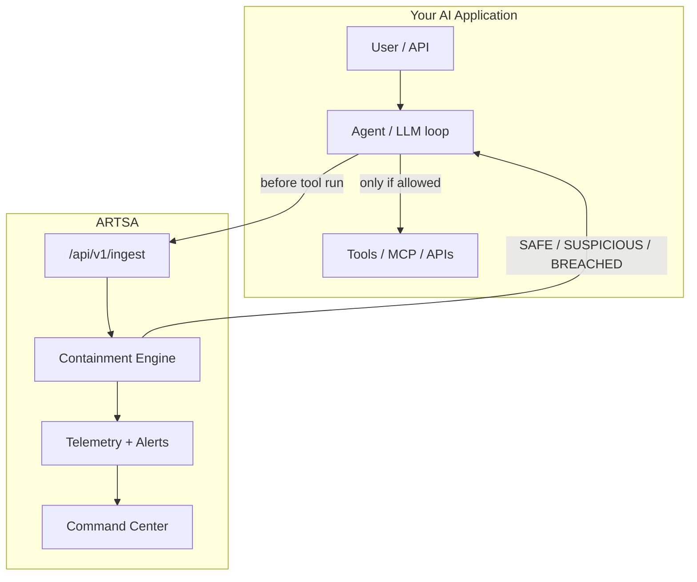

# ARTSA — Integrate Security Into Your AI Application

This guide lists **every integration path** ARTSA supports today: how to put containment in front of agent tools, MCP traffic, telemetry, CI, and the SOC dashboard.

**Golden rule:** ARTSA *detects and recommends*; your runtime *enforces*. After `POST /api/v1/ingest`, read `verdict.recommended_action` and do not execute the tool when it is `KILL` or `QUARANTINE`.



---

## 1. Direct HTTP ingest (any language)

**When:** Custom agent loops, Node, Go, Java, serverless — anything that can HTTP POST.

```http
POST /api/v1/ingest
Authorization: Bearer <api_key>
Content-Type: application/json

{
  "session_id": "550e8400-e29b-41d4-a716-446655440000",
  "agent_id": "support-bot",
  "tool_name": "read_file",
  "arguments": { "path": "/tmp/notes.txt" },
  "trace_id": "optional-correlation-id"
}
```

**Response (enforcement fields):**

```json
{
  "ingested": 1,
  "session_id": "...",
  "risk_score": { "overall_score": 12.0, "flags": [] },
  "verdict": {
    "verdict": "SAFE",
    "recommended_action": "NONE",
    "reasoning": "...",
    "confidence": 0.98
  },
  "evaluations": [ /* one per event if batch */ ]
}
```

| `recommended_action` | What your app should do |
|----------------------|-------------------------|
| `NONE` | Allow tool |
| `ALERT` / `THROTTLE` | Allow with rate limit / notify SOC |
| `QUARANTINE` | Block tool; freeze or sandbox session |
| `KILL` | Block tool; terminate agent session |

Batch: send a JSON **array** of events; use `evaluations[]` for per-tool decisions.

Auth: `X-API-Key` or Bearer (OIDC). Rate-limited. Target SLO: **&lt;50ms** eval.

---

## 2. Python SDK — `ArtsaClient` (sync HTTP)

```bash
cd sdk/python && pip install -e .
```

```python
from artsa import ArtsaClient, ArtsaBlockedError

client = ArtsaClient(
    api_url="http://localhost:8000",
    api_key="your-key",
    fail_closed=True,  # block tools if ARTSA is down (production)
)

try:
    client.guard_tool_call(
        session_id="550e8400-e29b-41d4-a716-446655440000",
        agent_id="support-bot",
        tool_name="execute_command",
        arguments={"cmd": "ls /"},
    )
    # run the real tool only after this returns
except ArtsaBlockedError as e:
    print("Blocked:", e)
```

`fail_closed=True` is the **default** (also via `ARTSA_FAIL_CLOSED`). Set `fail_closed=False` only for demos.

---

## 3b. ContainedAgent (multi-tool production runtime)

```python
from artsa import ArtsaClient, ContainedAgent, ArtsaBlockedError

client = ArtsaClient(api_key="...")
agent = ContainedAgent(client, agent_id="support-bot")
agent.register("search", search)
agent.register("read_file", read_file)

try:
    agent.call("search", query="refund policy")
except ArtsaBlockedError:
    # session is marked contained — further calls also fail
    ...
```

## 3c. LangGraph tool wrappers

```python
from artsa import ArtsaClient, wrap_langgraph_tool, guard_langgraph_tools

client = ArtsaClient(api_key="...")

@wrap_langgraph_tool(client, agent_id="ops-bot", session_id=session_id)
def search(query: str) -> str:
    ...
```

Fast-path EDS (no full ingest persistence) and trajectory APIs:

- `POST /api/v1/agents/eds/monitor`
- `POST /api/v1/agents/trajectory/evaluate`

---

## 3. Python decorator — wrap any tool function

```python
from artsa import ArtsaClient, guarded_tool

client = ArtsaClient(api_key="...", fail_closed=True)

@guarded_tool(client, agent_id="research-agent")
def read_file(path: str) -> str:
    return open(path).read()

read_file("/etc/passwd")  # evaluated before open()
```

---

## 4. LangChain callback

```python
from artsa import ArtsaClient, LangChainContainmentCallback

client = ArtsaClient(api_key="...", fail_closed=True)
callback = LangChainContainmentCallback(
    client, session_id=session_id, agent_id="langchain-agent"
)

# Pass callback into your agent / chain callbacks list.
# on_tool_start → ARTSA; raises RuntimeError on KILL/QUARANTINE.
```

File: `sdk/python/artsa/middleware/langchain.py`.

---

## 5. OpenAI function calling / tool_calls

```python
from artsa import ArtsaClient, wrap_openai_tools

client = ArtsaClient(api_key="...")  # fail_closed=True by default
dispatch = wrap_openai_tools(
    client,
    {"read_file": read_file, "search": search},
    session_id=session_id,
    agent_id="openai-agent",
)

for tc in message.tool_calls:
    result = dispatch(tc)  # guarded then executed
```

Same pattern for any API that returns `{function: {name, arguments}}`.

## 5b. TypeScript / Node SDK

```bash
cd sdk/typescript && npm install && npm run build
```

```ts
import { ArtsaClient } from "@artsa/sdk";
const client = new ArtsaClient({ failClosed: true }); // default
await client.guardToolCall({ sessionId, agentId, toolName, arguments: args });
```

---

## 5c. Provider Management API — add ANY API key / provider / model

Users can register their own LLM API keys at runtime (no env edits, no
redeploys). Keys are encrypted at rest with the platform `SECRET_KEY`, scoped
to the authenticated tenant, decrypted only while ARTSA creates the selected
provider client, and never returned by the API (masked only).

```bash
# 1. See every supported API (all options)
GET  /api/v1/providers/catalog

# 2. Add your own key — any provider type, custom base URL, default model
curl -X POST http://localhost:8000/api/v1/providers \
  -H "Content-Type: application/json" \
  -d '{"name":"my-groq","api_key":"gsk-...","provider_type":"groq",
       "base_url":"https://api.groq.com/openai/v1",
       "default_model":"openai/gpt-oss-120b"}'

# 3. Verify the key works (sends a tiny request)
POST /api/v1/providers/my-groq/test

# 4. Use it through the containment proxy — just send the provider name
curl http://localhost:8000/v1/proxy/chat/completions \
  -H "X-ARTSA-Provider: my-groq" \
  -d '{"model":"openai/gpt-oss-120b","messages":[...]}'
```

- Provider record → `X-ARTSA-Provider` header (any name you choose).
- **Any model** — send it in the payload; if omitted, the provider's
  `default_model` is used.
- **Any endpoint** — a custom OpenAI-compatible `base_url` is fully
  supported (private gateways, proxies, local servers).
- Providers can be updated (same `name`) or removed (`DELETE`).

> 🛡️ **SSRF guard.** In production the proxy refuses to forward to
> private/loopback/link-local hosts (e.g. `127.0.0.1`, `10.x`, `192.168.x`,
> `169.254.169.254`) chosen via `X-ARTSA-Forward-To`, a registered provider's
> `base_url`, or env config — a client API key must not be able to turn the
> proxy into an internal-network scanner. Local LLM deployments are the
> legitimate exception: set `ARTSA_PROXY_ALLOW_INTERNAL_TARGETS=true` to allow
> them in production (they are always allowed in dev/testing).

## 6. MCP proxy (Model Context Protocol)

Sit ARTSA **in front of** MCP `tools/call` / `tools/list` traffic:

```http
POST /api/v1/mcp/proxy
{ "method": "tools/call", "params": { "name": "delete_user", "input": "..." } }
```

If `action_taken` is `BLOCKED` or `is_safe` is false, **do not forward** the JSON-RPC to the MCP server.

Optional allow-lists:

- `ARTSA_MCP_ALLOWED_METHODS` — comma-separated methods (defaults include `tools/list`, `tools/call`, …)
- `ARTSA_MCP_ALLOWED_TOOLS` — when set, only these tool names may be called

SDK helper:

```python
result = client.inspect_mcp("tools/call", {"name": "shell", "input": "rm -rf /"})
if not result.get("is_safe"):
    raise RuntimeError("MCP blocked")
```

History: `GET /api/v1/mcp/inspections`.

---

## 7. OpenTelemetry / OpenInference traces — EXPERIMENTAL

> ⚠️ **Experimental.** The OTEL ingestor is a **heuristic placeholder**: it flags
> spans whose `input_prompt` contains a few hardcoded keywords and returns a
> synthetic drift score. It does **not** compute real embedding-vector drift and
> stores nothing (traces are kept in memory only). It is **disabled by default**
> and not a supported capability — enable it explicitly with
> `ARTSA_OTEL_ENABLED=true` (returns `404` otherwise).

```http
POST /api/v1/otel/v1/traces
{
  "trace_id": "...",
  "spans": [
    { "name": "tool.execution", "attributes": { "input_prompt": "..." } }
  ]
}
```

Use for **async / post-hoc** detection when you cannot block inline, or as a second signal next to ingest.

---

## 8. Org policies (YAML rules)

Tune detectors without redeploying agents:

- API: `/api/v1/policies`
- Config: `backend/configs/org_policies/default.yaml`
- UI: **Policies** page (capability-gated)

Map custom rules onto your tenant so ingest flags match your tool taxonomy.

---

## 9. Input/output guardrails (model layer)

Complement tool containment with prompt/response filters in `backend/src/agents/guardrails/`:

- Heuristic filters (always)
- **Lakera Guard** when `LAKERA_API_KEY` is set
- **Azure Content Safety** when `AZURE_CONTENT_SAFETY_KEY` is set

Use for **chat/RAG** surfaces; still send **tool calls** through ingest.

---

## 10. Alerts & webhooks (SOC / PagerDuty / Slack)

Configure via `/api/v1/alerts/webhooks`. High-risk ingest events feed the Alerts inbox and external channels so humans respond when agents are quarantined.

---

## 10b. Custom outbound connectors — any HTTP system

Beyond the built-in channels, define **config-driven connectors** to *any* HTTP
system (custom SIEM, ticketing, chat bot, internal tool…) with no code and no
redeploy. Each connector declares a method, URL, headers, auth, a JSON payload
template, and which events trigger it. Manage them in the UI
(**Settings → Integrations → Custom Outbound**) or via `/api/v1/integrations`.

**Connector fields**

| Field | Meaning |
|---|---|
| `name` | Unique slug (auto-normalized; `My SIEM` → `my-siem`) |
| `method` | `POST` / `PUT` / `PATCH` |
| `target_url` | Endpoint that receives the payload |
| `auth_type` | `none` / `bearer` / `basic` / `api_key` — secrets encrypted at rest |
| `headers` | Custom headers; values may embed `{{secret:name}}` |
| `payload_template` | JSON body template; `null` = send the full default event |
| `event_types` | Which events fire the connector: `alert`, `tool_call`, `proxy_call`, `session_action` |
| `risk_threshold` | Only deliver events with `risk_score >= threshold` (0–100) |
| `enabled` / `retries` / `timeout` | Delivery controls |

**Payload templating**

Placeholders use `{{field}}` or dotted paths `{{a.b.0.c}}` resolved against
the event. A whole-token placeholder keeps its type (numbers stay numbers);
embedded tokens are stringified. Unresolved tokens are left untouched so a
missing optional field never breaks delivery.

```json
{
  "source": "ARTSA",
  "alert_id": "{{id}}",
  "agent_id": "{{agent_id}}",
  "severity": "{{severity}}",
  "message": "{{message}}",
  "risk_score": "{{risk_score}}"
}
```

Secrets referenced in headers or the template — `{{secret:token}}`,
`{{secret:api_key}}`, `{{secret:username}}`, `{{secret:password}}` — are
**Fernet-encrypted at rest** with the platform `SECRET_KEY` and never returned
by the API (only masked as `secrets_masked`). Rotating `SECRET_KEY` invalidates
stored connector secrets (same behavior as provider keys).

**API reference**

```bash
# Advertised event types, auth types, and template fields
curl -s localhost:8000/api/v1/integrations/schema

# Create a connector (409 on duplicate slug)
curl -s -X POST localhost:8000/api/v1/integrations -H 'Content-Type: application/json' -d '{
  "name": "my-siem",
  "method": "POST",
  "target_url": "https://sink.example.com/ingest",
  "auth_type": "bearer",
  "headers": {"X-Tenant": "acme"},
  "payload_template": "{\"agent\": \"{{agent_id}}\", \"risk\": \"{{risk_score}}\"}",
  "event_types": ["alert", "tool_call"],
  "risk_threshold": 70,
  "enabled": true,
  "secrets": {"token": "super-secret"}
}'

# List (secrets masked), read one, update (PATCH preserves unmentioned secrets),
# delete — and fire a synthetic sample event through it:
curl -s -X POST localhost:8000/api/v1/integrations/my-siem/test \
  -H 'Content-Type: application/json' -d '{"event_type": "alert"}'
# → {"status": "sent", "event_type": "alert", "detail": ""}
```

The Test action never raises and never echoes secrets; `status` is `sent` when
any delivery attempt succeeded. Dispatch is non-blocking (bounded worker queue)
so connector latency or outages never slow the ingest hot path.

---

## 10c. MongoDB document sink (optional)

Point ARTSA at a MongoDB Atlas cluster and every **alert**, **telemetry event**
(`tool_call` / `proxy_call` / `session_action`) and **ingest evaluation** is
written into a dedicated database — so ARTSA data lives in its own namespace,
never inside an existing application database.

```bash
# backend/.env (already present for you with database "artsa")
ARTSA_MONGODB_URI=mongodb+srv://<cluster>.mongodb.net/artsa?retryWrites=true&w=majority
ARTSA_MONGODB_DB=artsa        # the database ARTSA writes to (never staff-db)
```

- Unset `ARTSA_MONGODB_URI` (or set it to `disabled`) to turn the sink off — it
  is a pure no-op then; ARTSA's own SQLite/Postgres store is always the source
  of truth.
- Writes are non-blocking: producers `put_nowait` into a bounded queue and a
  single worker thread owns the pymongo client. Mongo latency/outages never
  block ingest or alert dispatch (a full queue drops with a warning).
- Collections: `alerts`, `events`, `evaluations`. Every document carries a `ts`
  field (UTC ISO). Alerts also carry the parsed `risk_score`, `severity`,
  `session_id`, `agent_id`, and the raw `title`/`message`.
- Any other system (dashboard, data warehouse, your Streamlit app) can read the
  documents directly: `db = MongoClient(uri)["artsa"]; list(db["alerts"].find({}).sort("_id", -1).limit(50))`.

---

## 11. Live dashboard & WebSocket

- UI: `http://localhost:3000` (Command Center, Observatory, Topology, Risks, Replay)
- WS: `/api/v1/websocket` — live telemetry for custom SOC UIs
- Metrics: `/api/v1/metrics/dashboard`, Prometheus scrape path

Your app only needs ingest; operators use the dashboard for visibility.

---

## 12. Shift-left / CI red team (`artsa.test`)

In-repo SDK for **campaign-style** assessment of a target model (not live tool gating):

```python
from src.sdk import test as artsa_test

result = artsa_test(
    target_provider="groq",
    target_model="openai/gpt-oss-120b",
    policy="quick_scan",
    rounds=5,
)
assert result.passed
```

Also: **Wargame** UI + `POST /api/v1/campaigns/run`, **Attack Library**, **Benchmark** endpoints.

---

## 13. Async / scale path (Redis + Celery)

- Ingest publishes to Redis stream `events:incoming`
- Optional `USE_CELERY=true` for async side processing
- Keep **synchronous ingest response** for inline enforcement; use Celery for heavy follow-up work

---

## 14. Next.js / BFF proxy

Frontend and browser apps should not call the containment API with secrets. Use the Next BFF:

- Browser → `/api/backend/...` → ARTSA (`NEXT_PUBLIC_API_URL` / server-side proxy)
- See `frontend/app/api/backend/[...path]/route.ts`

For a Node agent, prefer the Python SDK pattern via HTTP ingest (section 1) with a server-side API key.

---

## 15. Session forensics & compliance

After an incident:

| Endpoint / UI | Purpose |
|---------------|---------|
| `/replay` + session timeline | Step-by-step autopsy |
| `/api/v1/forensics/analyze` | Trajectory analysis |
| `/api/v1/compliance/export` | EU AI Act / NIST style export (gateway + reporting) |
| `/risks` | Agentic Top 10 mapped to live flags |

---

## 16. MCP stdio containment wrapper

For local MCP servers, point the client at ARTSA's process wrapper instead of
the server directly. The wrapper owns the JSON-RPC stdin/stdout pipe, blocks
unsafe `tools/call` requests before they reach the child, and withholds unsafe
tool results before the client receives them.

```json
{
  "mcpServers": {
    "filesystem": {
      "command": "artsa-mcp-stdio",
      "args": ["--", "npx", "-y", "@modelcontextprotocol/server-filesystem", "/data"]
    }
  }
}
```

`QUARANTINE` returns a digest-only `approval_required` JSON-RPC error. After
an operator approves it through ARTSA, retry the exact `tools/call` with the
one-time token in `params._meta.artsa.retry_token`. ARTSA strips that extension
before forwarding the request to the real server, binds it to the wrapper
session and canonical tool parameters, and scans the rerun result again.

This is newline-delimited stdio only. Streamable HTTP/SSE MCP remains outside
the live containment boundary.

---

## Recommended stack by app type

| Your stack | Primary path | Also use |
|------------|--------------|----------|
| Custom Python agent | Decorator or `guard_tool_call` | Policies + dashboard |
| LangChain / LangGraph | `LangChainContainmentCallback` | Wargame in CI |
| OpenAI tools / Assistants | `wrap_openai_tools` | Alerts webhook |
| Node / TypeScript agents | `@artsa/sdk` (`sdk/typescript`) | Fail-closed by default |
| Local MCP stdio servers | `artsa-mcp-stdio -- <server>` | Approval queue for quarantined results |
| MCP HTTP inspection | `/mcp/proxy` before forward | Detect-only; not an interception boundary |
| Already on OTEL | `/otel/v1/traces` *(experimental, opt-in)* | Ingest for blocking |
| Node / other | Raw HTTP ingest | BFF if browser-facing |
| Pre-prod hardening | Campaigns + `artsa.test` | Attack library |

---

## Minimal production checklist

1. Issue an API key (or OIDC); never embed keys in browsers.
2. Instrument **every** tool / MCP call with ingest **before** execution.
3. Enforce `KILL` / `QUARANTINE` in the agent runtime (`fail_closed=True`).
4. Keep tools least-privilege even when ARTSA allows them.
5. Wire alerts + review Command Center during rollout.
6. Run wargame / CI scans so detectors stay tuned to your tools.
7. Map findings to Agentic Risks / OWASP LLM Top 10 for audits.

Full go-live list: **[PRODUCTION_CHECKLIST.md](./PRODUCTION_CHECKLIST.md)** · sample: `python examples/production_agent.py`

---

## Related docs

- `backend/docs/API_SURFACE.md` — route map
- `docs/PLATFORM_MATURITY.md` — capability maturity
- `docs/ENV_SETUP.md` / `docs/OIDC_SETUP.md` — env and auth
- `sdk/python/` — installable Python package
